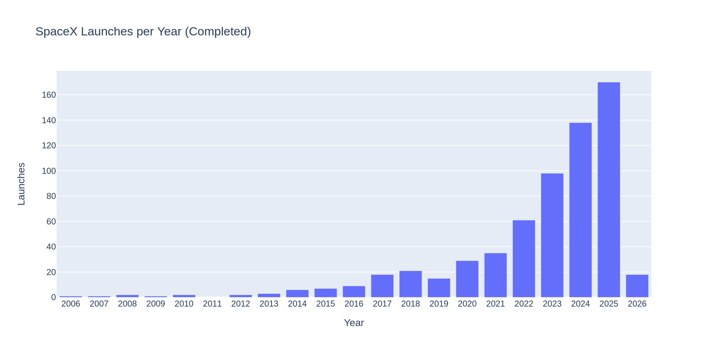
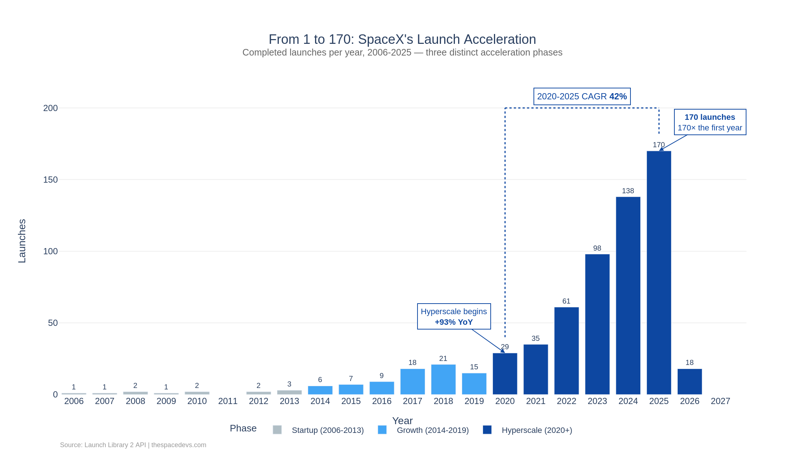

# Launch Cadence - Bar

## Introduction

How does SpaceX go from _1_ launch in 2006 to _170_ in 2025? :chart_with_upwards_trend:

In this tutorial you will see SpaceX go through 3 phases:

- :seedling: **Startup (2006-2013)**: single digit launches to prove vehicles work
- :fire: **Growth (2014-2019)**: a steady increase from 6 to 21 launches each year
- :rocket: **Hyperscale (2020-to date)**: Operations scale driven by reusability of Falcon 9 Block 5 and Starlink

You will start by creating a simple bar chart:

Working step by step through **colour**, **annotation** and **composition** to finish with this:

## Getting Started

